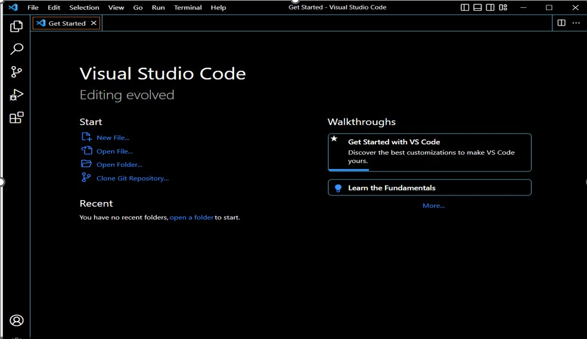
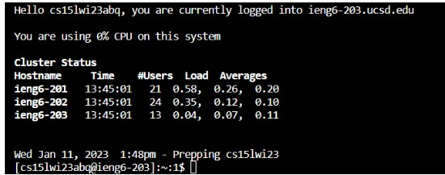
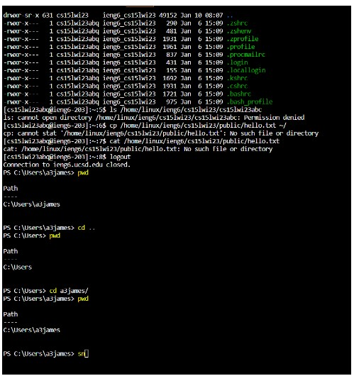

# **CSE 15L-lab-report**

# First lab report

In this lab report, I shall be writing a 
blog post about remote access. I hope that
this lab report shall serve utmost utility
for those who shall be taking CSE 15-L in 
the future.

## Step 1
### Explore your course specific account for CSE 15L

* Click on following link: [Link](https://sdacs.ucsd.edu/~icc/index.php)

* For information on how to navigate through above link click following tutorial link: 
  [Link](https://docs.google.com/document/d/1hs7CyQeh-MdUfM9uv99i8tqfneos6Y8bDU0uhn1wqho/edit)
  
## Step 2
### Open Visual Studio (I was using the school computers) and understand why you are using it

* I decided to use the school computer instead of my own so I don't have much to add regarding visual studio code download

* When you should open Visual Studio in the school computer, you must see a snapshot like this:



* The use of Visual Studio is for connecting your github code with Visual Studio code

* This can be done through the clone github repository button which you can see in the image above

* You will then be led to a page where you must enter the link of your github repository


## Step 3
### Try to connect to remote server which is dedicated specifically for your CSE 15L account

* In above snapshot, click new file and follow the instructions

* When new file is opened, go to the topmost bar and try to find terminal section

* Terminal section has an option open new terminal which must be clicked

* Write the following command: "**ssh cs15lwi23zz@ieng6.ucsd.edu**" but replace zz with the letters specific from your account

* There will be question asked "Are you sure you want to continue connecting?" which should be answered by a Yes

* There will be a password asked (NOTE: if you don't see any dots on screen when typing, don't worry. Its part of protection of information protocol)

* This is what must be seen when being able to successfully login.


 
## Step 4
### Try some sample commands

Below are sample commands that you can try:

``` Sample commands to try in your VS code terminal

# 

* cd -- changes working directory

* pwd -- print working directory

* ls -- Used to list files and folders of a given path

* cp /home/linux/ieng6/cs15lwi23/public/hello.txt ~/ -- creates copy of files in directory to another location

``` 

Below is a snapshot where I have tried to implement some sample commands:



* I mainly decided to focus on using pwd and cd commands since I was most curious of those commands

* This was because a few days ago, I had done an exercise seeing the effect of merging working directory with relative path

* The results were as expected. For example, when using pwd and then using cd to change working directory, things had worked out as expected

