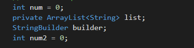
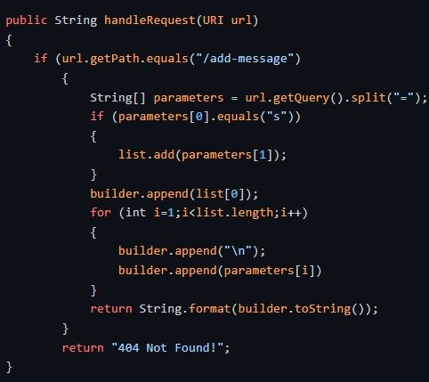
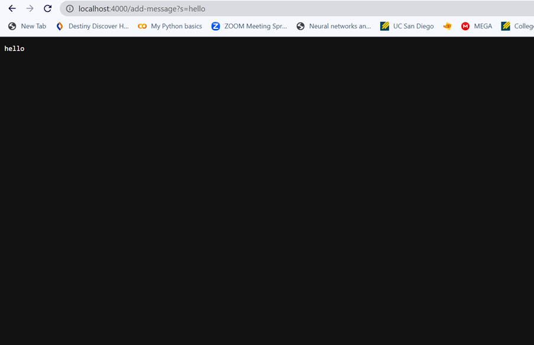
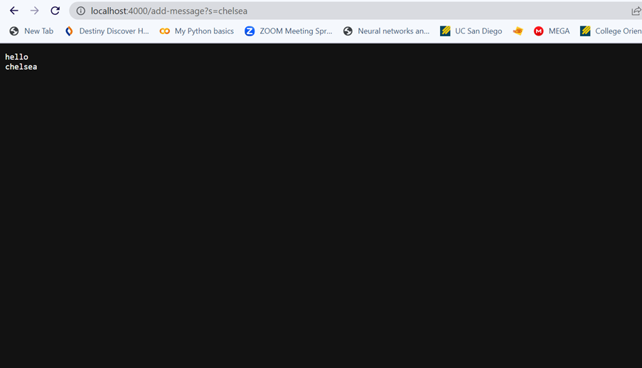
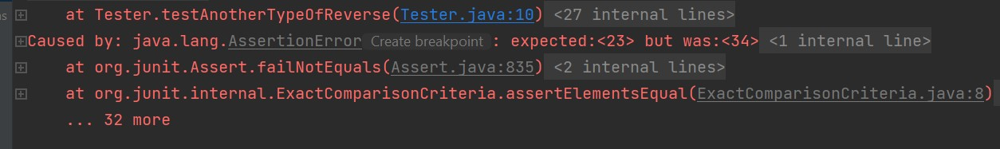

# Second CSE 15-L Report (Week 3)

## Part 1
### Writing a StringServer

* This program has the following feature:
When you have the following path "/add-message?s=<string>", the webpage prints out the string value.
Another feature to note is that this program keeps note of all the strings printed.
  
* Below is the code block for my StringServer:
  
  
  
  
  
  * When looking at the code used, I had to use the concept of different portions like path, query.
  
  * In the second image, I first called the getPath() method which returns path of the URL . 
  
  * Since I was only interested in value of path at first, I used the getPath() method to get value of path of the URL
  
  * The only possible valid value of path was "/add-message" which explains the first if-method in the second image
  
  * After that, I used the split method to split the query of the URL (which I got thanks to the getQuery method) based on equals sign.  
  
  * I did a check to ensure the first part of query, before the equal sign, was an "s". 
  
  * In the first picture, I created a stringbuilder and arrayList to keep track of all the words added and print them out in a correct order
  
  * As you can see from above, I had to try to check whether path of URL was valid and when affirmed I had to check whether the query had an "s" to ensure
    printing of word on the website 
  
  * I called the String.Format() to print out all the words stored in stringbuilder onto the server 
  
  * Below are two screenshots of implementation of "/add-message"
  
    
  
 
  * For the first implementation, a check was implemented for valid path "/add-message"
  
  * Then the query (portion after question mark) was split based on equal sign
  
  * If first part of query is an "s", then second part of query, which is the word inputted by user, is added to an ArrayList
  
  * Then this word is appended to a StrinBuilder and then is printed out on the website
  
  
    
  
  * For the second implementation, a check was implemented for valid path "/add-message"
  
  * Then the query (portion after question mark) was split based on equal sign
  
  * If first part of query is an "s", then second part of query, which is the word inputted by user, is added to an ArrayList
  
  * Then the first word of arrayList is added to stringBuilder (stringbuilder has always been initialized after every new implementation)
  
  * Then a for-loop is executed which adds appends the words from arrayList to stringBuilder (before word is added, a new line is created)
  
  * Then history of all words passed to website is printed in the website
  
  
  
  * The only value that would change to ensure that website works as illustrated in the screenshot above is the query portion of the website
  

## Part 2
### Exploring JUnit
  
 * In this part I shall be talking about the JUnit class
  
 * JUnit is responsible for ensuring unit testing in Java programs which is very beneficial to ensuring right running of methods within a program
  
 * We will be talking about ArrayReverseMethod which we(including our group) had to fix
  
  ```
# Buggy code block
 static void reverseInPlace(int[] arr) {
    for(int i = 0; i < arr.length; i += 1) {
      arr[i] = arr[arr.length - i - 1];
    }
  }
```
 
   * Below are the JUnit Tests
 
* Below is the first JUnit test which does not show the flaws in the program
                                  
 ```
# code block
 public void testAnotherTypeOfReverse()
 {
    int[] input = {3};
    ArrayExamples.reverseInPlace(input);
    assertArrayEquals(new int[]{3},input};                              
 }  
```
                                  
* Below two tests are tests which do show the flaws in the program     
                                  
 ```
# First JUnit Test
@Test
    public void testTypeOfReverse()
    {
        int[] input = {12,23,34,45};
        Array.reverseInPlace(input);
        assertArrayEquals(new int[]{45,34,23,12},input);
    }                               
```
                                  
  ```
# Second JUnit Test
@Test
    public void testTypeOfReverse()
    {
        int[] input = {12,23,34};
        Array.reverseInPlace(input);
        assertArrayEquals(new int[]{34,23,12},input);
    } 
```
                                  
* Below is an image which shows the message displayed in terminal due to incorrect implementation of reverseArray method 
  (NOTICE: J-Unit tests have worked. I just used a different code editing software called IntelliJ.)
                                  
                              

                                  
                                  
* The original code had end counter variable at arr.length instead of arr.length/2
* The original code also forgot to use a temporary variable to store the value of original variable at a certain index
* To expose this, I used multivariable arrays with both odd and even lengths
* I amended the following stuff mentioned above and my code worked
                                  
 ```
# code block
static void reverseInPlace(int[] arr) {
    for(int i = 0; i < arr.length; i += 1) {
      int temp = arr[i];
      arr[i] = arr[arr.length - i - 1];
      arr[arr.length - i - 1] = temp;
    }
  }
```

                                                                 
## Part 3
### Reflections about lab 2 and lab 3                              
                                  
 * In lab 2, I did not have much of an idea about different parts of the URL. However, after doing lab 2, I understood what is a path, query and other parts of URL
  
 * In lab 3, I was able to use JUnit tests with much more profiency and I think I can do a better job at committing and pushing code to my GitHub repository 
                                  
                                  

