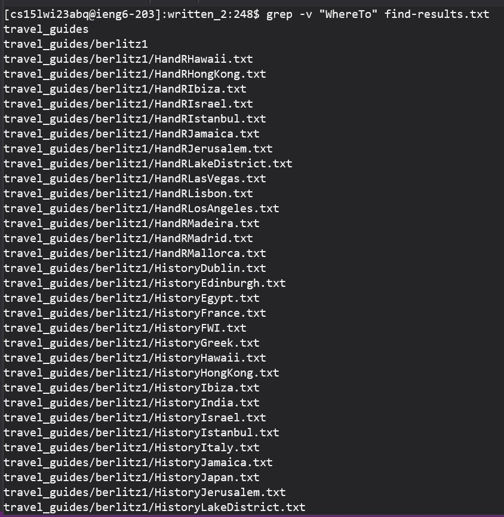

# CSE 15L (Third Lab report)

In this lab, I am going to be reporting my findings on research on the grep command. There are 4 possible variations of the grep command: 

* grep "some string" <name of .txt file>
  
* grep -v <name of .txt file>
  
* grep -n <name of .txt file>
  
* grep -c <name of .txt file>
  
  
## First type
### grep "some string" <name of .txt file>
  
  
This type of grep gives an output which shows all lines that have "some string" word in the line. Below are two examples.
  
  ```
# First code block example
grep "WhatToDo" find-results.txt
```
  
This is the output you receive when trying to find the number of lines which have "WhatToDo" in the find-results.txt file.
  
```
  # Output
travel_guides/berlitz2/Algarve-WhatToDo.txt
travel_guides/berlitz2/Amsterdam-WhatToDo.txt
travel_guides/berlitz2/Athens-WhatToDo.txt
travel_guides/berlitz2/Bahamas-WhatToDo.txt
travel_guides/berlitz2/Bali-WhatToDo.txt
travel_guides/berlitz2/Barcelona-WhatToDo.txt
travel_guides/berlitz2/Beijing-WhatToDo.txt
travel_guides/berlitz2/Berlin-WhatToDo.txt
travel_guides/berlitz2/Bermuda-WhatToDo.txt
travel_guides/berlitz2/Budapest-WhatToDo.txt
travel_guides/berlitz2/California-WhatToDo.txt
travel_guides/berlitz2/CanaryIslands-WhatToDo.txt
travel_guides/berlitz2/Cancun-WhatToDo.txt
travel_guides/berlitz2/China-WhatToDo.txt
travel_guides/berlitz2/Costa-WhatToDo.txt
travel_guides/berlitz2/CostaBlanca-WhatToDo.txt
travel_guides/berlitz2/Crete-WhatToDo.txt
travel_guides/berlitz2/Cuba-WhatToDo.txt
travel_guides/berlitz2/Nepal-WhatToDo.txt
travel_guides/berlitz2/Paris-WhatToDo.txt
travel_guides/berlitz2/Poland-WhatToDo.txt
travel_guides/berlitz2/Portugal-WhatToDo.txt
travel_guides/berlitz2/PuertoRico-WhatToDo.txt
travel_guides/berlitz2/Vallarta-WhatToDo.txt
```

  
  ```
# code block
grep "History" find-results.txt
```
This is the output you receive when trying to find the number of files which are part of berlitz 1 in the find-results.txt file.
  

 
  
## Second type
### grep -v "some string" <name of .txt file>
  
This type of grep command is responsible for finding the lines which do not contain a certain string. Below are two code examples and their respective outputs.

  
  ```
# code block
grep -v "WhereTo" find results-txt
```
This is the output you receive when trying to find the number of files which do not have WhereTo in their path in the find-results.txt file.
  
 
  
  ```
# code block
grep -v ".txt" find-results.txt
```
This is the output when trying to find the amount of non-".txt" files in find-results.txt file. 
  
  

  
  
  
  
